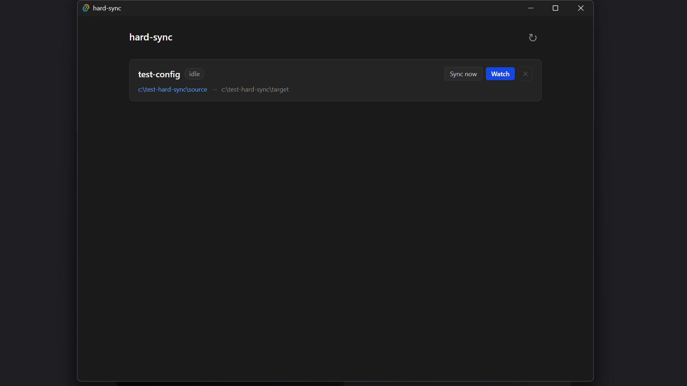

# hard-sync

<p align="center">
  
</p>

<p align="center">
  A fast, zero-interaction file sync tool for removable drives.<br/>
  Set up a pair once — plug in your drive, hear the start sound, hear the done sound, unplug.<br/>
  <strong>No typing required after setup.</strong>
</p>

---

## Two ways to use it

| | CLI (`hsync`) | Desktop app |
|---|---|---|
| Install | `cargo install hard-sync-cli` | Download installer from [Releases](https://github.com/codad5/hard-sync-cli/releases) |
| Use | Terminal commands | GUI window + system tray |
| Watcher | `hsync watch --name backup` | Click **Watch** on a pair |
| Background | `hsync watch --name backup --detach` | Runs in system tray |
| Autostart | `hsync autostart enable --name backup` | Planned |

Both are built on `hard-sync-core` — the same sync engine, drive detection, and config file.

---

## Desktop app

<p align="center">
  
</p>

The desktop app lives in the system tray. Left-click the tray icon to open the window. From there you can:

- View all configured sync pairs and their watcher status
- Trigger a one-shot sync with **Sync now**
- Start or stop a watcher with **Watch** / **Stop**
- Add new pairs with folder picker dialogs
- Remove pairs

Download the latest installer from the [Releases](https://github.com/codad5/hard-sync-cli/releases) page (`.exe` for Windows, `.AppImage`/`.deb` for Linux, `.dmg` for macOS).

---

## How It Works

You define a **sync pair**: a `base` path and a `target` path, with one side designated as the source of truth. For drive pairs, `hard-sync` identifies the drive by UUID and volume label — not by mount path — so it finds it wherever the OS mounts it.

In watch mode:
- **Same-drive pairs** — file watcher triggers sync on change (debounced 500ms)
- **Cross-drive pairs** — drive poller detects plug-in, syncs immediately, then watches for changes until drive is removed

---

## CLI install

### From crates.io

```bash
cargo install hard-sync-cli
```

### From source

```bash
git clone https://github.com/codad5/hard-sync-cli
cd hard-sync-cli
cargo install --path cli
```

Confirm:

```bash
hsync --help
```

---

## CLI commands

### `hsync init` — Set up a new sync pair

```bash
hsync init --name <name> --base <path> --target <path> [--source base|target]
```

Detects whether base and target are on the same drive automatically. For cross-drive pairs, stores the drive's UUID and volume label so it can be found in watch mode regardless of mount path.

```
Pair "backup" initialized.
  base:    /home/user/projects
  target:  /media/usb/projects
  source:  base
  drive:   MY_USB (uuid: a1b2-c3d4)
  delete:  trash
```

---

### `hsync sync` — One-shot sync

```bash
hsync sync --name <name> [--dry-run] [--verify]
```

| Flag | Description |
|------|-------------|
| `--dry-run` / `-d` | Show what would change, touch nothing |
| `--verify` / `-v` | Use SHA256 comparison instead of mtime+size |

```
Syncing "backup"...
  + copied   src/main.rs
  ~ updated  src/config.rs
  - trashed  old_notes.txt

Done.  2 copied  1 updated  1 trashed  143 skipped  0 errors
```

---

### `hsync watch` — Auto-sync on drive detect / file change

```bash
hsync watch --name <name>           # foreground — blocks until Ctrl+C
hsync watch --name <name> --detach  # background — spawns a daemon, returns immediately
```

Foreground mode blocks until Ctrl+C. Background mode (`--detach`) writes the process PID and log output to `~/.local/share/hsync/` (Windows: `%APPDATA%\hsync\`) and exits.

```
Watching "backup"...
Press Ctrl+C to stop.

  Ready. Watching for changes...
  [14:23:01] Drive detected at E:\ — syncing...
  Done.  5 copied  0 updated  0 trashed  210 skipped
  Watching for changes...
```

#### Managing background watchers

```bash
hsync watch list                     # show all running background watchers
hsync watch attach --name <name>     # tail the log (Ctrl+C detaches, watcher keeps running)
hsync watch stop --name <name>       # stop a specific background watcher
hsync watch stop --all               # stop all background watchers
```

---

### `hsync autostart` — Run watchers on login

Register a watcher to start automatically in the background when you log in:

```bash
hsync autostart enable --name <name>   # register with OS startup
hsync autostart disable --name <name>  # unregister
hsync autostart list                   # show enabled/disabled status for all pairs
```

Uses the OS-native startup mechanism (Windows registry, Linux XDG autostart, macOS launchd).

---

### `hsync list` — Show all configured pairs

```bash
hsync list
```

---

### `hsync drives` — Show connected drives

```bash
hsync drives
```

Lists all currently mounted drives. Annotates any drive that matches a configured pair.

---

### `hsync set-source` — Flip source of truth

```bash
hsync set-source --name <name> --source base|target
```

---

### `hsync remove` — Remove a pair

```bash
hsync remove --name <name>
```

Does not delete any files — only removes the pair from config.

---

### `hsync config` — Config file management

```bash
hsync config path    # print the path to the config file
hsync config reset   # delete the config file and remove all pairs
```

---

### `hsync trash list` / `hsync trash clear` — Manage the trash

Files deleted from target (when `delete_behavior = trash`) go to `.hard-sync-trash/` on the target. You can inspect and clear it:

```bash
hsync trash list --name <name>
hsync trash clear --name <name>
hsync trash clear --all
```

---

## Config

Config is stored at `~/.config/hard-sync/config.json`. All settings are managed through commands — you should not need to edit it directly.

**Ignore patterns:** Add a `.hardsyncignore` file to your base directory (gitignore syntax). Patterns can also be added per-pair in config. Built-in ignores: `.hard-sync-trash/`, `.hardsyncignore`.

**Delete behavior** (per pair, edit config directly): `"trash"` (default), `"delete"`, or `"ignore"`.

**Notification sounds** (per pair, edit config directly): set `sounds.sync_start`, `sounds.sync_done`, or `sounds.sync_error` to a path to a WAV or MP3 file. Null by default.

---

## Crates

| Crate | Role | Published |
|-------|------|-----------|
| [`hard-sync-core`](https://crates.io/crates/hard-sync-core) | Library — all sync logic, drive detection, config, watcher | ✅ crates.io |
| [`hard-sync-cli`](https://crates.io/crates/hard-sync-cli) (`hsync`) | Binary — thin CLI wrapper over core | ✅ crates.io |

If you want to build your own frontend (GUI, TUI, daemon), depend on `hard-sync-core` directly:

```toml
[dependencies]
hard-sync-core = "0.2"
```

---

## Platform support

| Feature | Windows | Linux | macOS |
|---------|---------|-------|-------|
| File sync | ✅ | ✅ | ✅ |
| Drive detection (by UUID/label) | ✅ | ✅ | ✅ |
| Watch mode | ✅ | ✅ | ✅ |
| Background watcher (`--detach`) | ✅ | ✅ | ✅ |
| Autostart on login | ✅ (registry) | ✅ (XDG) | ✅ (launchd) |
| Notification sounds | ✅ | ✅ | ✅ |
| Desktop app (Tauri) | ✅ | ✅ | ⚠️ untested |

macOS builds should work but have not been tested. If you run into issues, please [open an issue](https://github.com/codad5/hard-sync-cli/issues).

---

## Roadmap

### SSH sync (planned)

Support for syncing with remote paths over SSH:

```bash
hsync ssh add --name myserver --host user@192.168.1.10 --key ~/.ssh/id_rsa
hsync init --name cloud-backup --base ~/projects --target ssh://myserver/home/user/backup
```

---

## License

MIT
